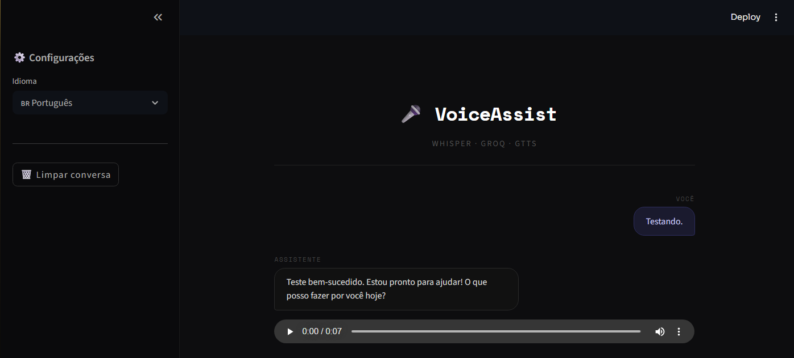
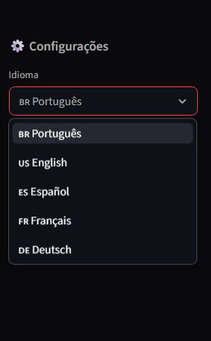
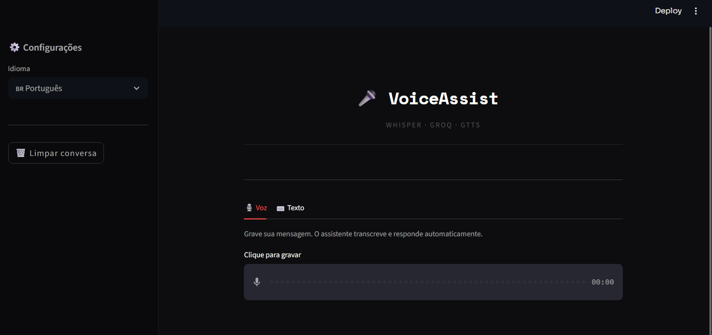
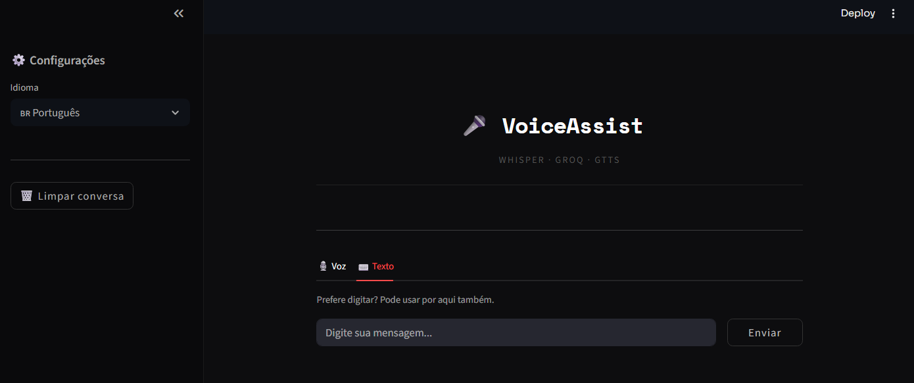

# VoiceAssist

Assistente de voz em Streamlit com entrada por audio ou texto.

O fluxo da aplicacao e:
1. Capturar audio (ou texto digitado).
2. Transcrever com Whisper.
3. Gerar resposta com Groq (Llama 3.3 70B).
4. Converter resposta em voz com gTTS.

## Funcionalidades

- Conversa por voz com transcricao automatica.
- Conversa por texto na mesma interface.
- Resposta em audio reproduzida no chat.
- Suporte a multiplos idiomas na interface: `pt`, `en`, `es`, `fr`, `de`.
- Historico de conversa na sessao e botao para limpar chat.

## Stack

- Streamlit
- OpenAI Whisper (local)
- Groq API
- gTTS
- python-dotenv

## Requisitos

- Python 3.10+ (recomendado)
- Chave de API da Groq: https://console.groq.com/keys

## Instalacao

1. Clone o repositorio e entre na pasta do projeto.
2. Crie e ative um ambiente virtual.
3. Instale as dependencias.

### Windows (PowerShell)

```powershell
python -m venv .venv
.\.venv\Scripts\Activate.ps1
pip install -r requirements.txt
```

## Configuracao

Crie um arquivo `.env` na raiz com:

```env
GROQ_API_KEY=sua_chave_aqui
```

## Executar

```bash
streamlit run app.py
```

Abra o endereco exibido no terminal (geralmente `http://localhost:8501`).

## Como usar

1. Escolha o idioma na barra lateral.
2. Aba Voz: clique no gravador, fale e aguarde a transcricao/resposta.
3. Aba Texto: digite a mensagem e clique em `Enviar`.
4. Use `Limpar conversa` para reiniciar o chat da sessao.

## Demonstracao

### Tela principal



### Selecao de idiomas



### Conversa por voz



### Conversa por texto



## Estrutura do projeto

```text
voiceAssist/
   app.py
   requirements.txt
   README.md
   assets/
```

## Troubleshooting

- Erro `GROQ_API_KEY nao encontrada no .env`:
   - Verifique se o arquivo `.env` esta na raiz e com a variavel correta.
- Erro de transcricao/FFmpeg:
   - Garanta que o FFmpeg esteja instalado e no `PATH`.
   - Teste com `ffmpeg -version` no terminal.
- Primeira execucao lenta:
   - O Whisper pode baixar/carregar modelo na primeira vez.

## Melhorias futuras

- Streaming de resposta em tempo real.
- Selecao de modelo Groq pela interface.
- Persistencia de historico em banco.
- Tratamento de erros mais detalhado para API e audio.